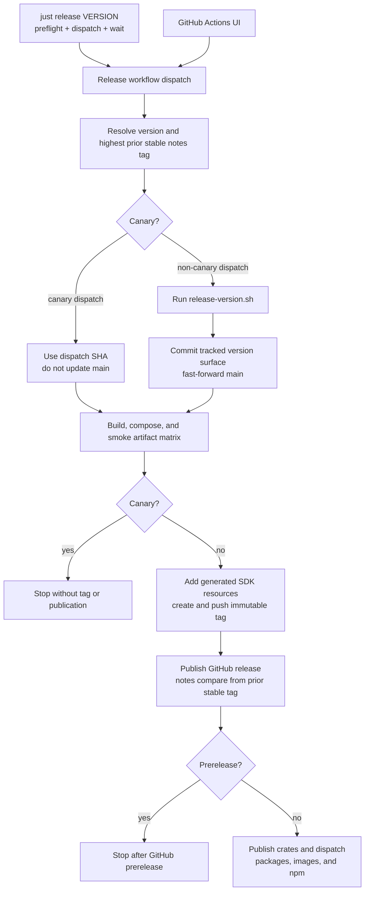
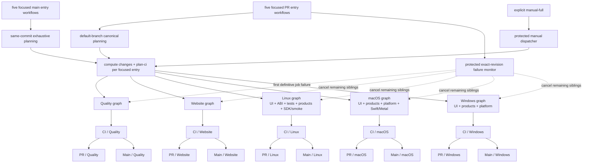

# MeshLLM CI topology

This is the checked-in implementation. Normative rules live in
`.agents/skills/manage-ci/SKILL.md`; the factual inventory is in
`.agents/skills/manage-ci/references/current-inventory.md`; the design record
and acceptance criteria are in `.omo/specs/pr-ci-optimization.md`.

## Entry points

| Workflow | Trigger | Role |
| --- | --- | --- |
| `pr_quality.yml` (`PR · Quality`) | `pull_request` | Plans and calls the protected Quality lane |
| `pr_website.yml` (`PR · Website`) | `pull_request` | Plans and calls the protected Website lane |
| `pr_linux.yml` (`PR · Linux`) | `pull_request` | Plans and calls the protected Linux lane |
| `pr_macos.yml` (`PR · macOS`) | `pull_request` | Plans and calls the protected macOS lane |
| `pr_windows.yml` (`PR · Windows`) | `pull_request` | Plans and calls the protected Windows lane |
| `pr-cancel-sibling-runs.yml` (`PR · Cancel sibling lanes`) | protected `workflow_run` for `PR · Quality` | Watches one exact PR revision and cancels its other validation lanes after the first job failure |
| `main_quality.yml` (`Main · Quality`) | push to `main` | Plans and calls the same-commit Quality lane |
| `main_website.yml` (`Main · Website`) | push to `main` | Plans and calls the same-commit Website lane |
| `main_linux.yml` (`Main · Linux`) | push to `main` | Plans and calls the same-commit Linux lane |
| `main_macos.yml` (`Main · macOS`) | push to `main` | Plans and calls the same-commit macOS lane |
| `main_windows.yml` (`Main · Windows`) | push to `main` | Plans and calls the same-commit Windows lane |
| `ci.yml` | `workflow_call` only | Temporary inert compatibility for the former main ingress filename, pending the protected-main runner-contract update |
| `ci-control.yml` (`CI · Manual Full`) | `workflow_dispatch` on `main` | Explicit operator-only full plan, detached lane dispatch, and correlated diagnostic checks |
| `ci-*-lane.yml` | `workflow_call`, `workflow_dispatch` | Composable Quality, Website, Linux, macOS and Windows graphs |
| `nightly-stability.yml` / `nightly-stability-run.yml` | daily schedule, dispatch / reusable | GitHub-hosted live-endpoint evidence. The general stability and KV tool-loop/prefix-reuse harnesses run independently, upload both evidence sets, and preserve either failure. The reusable workflow accepts no runner label. |
| `nightly-kv-coverage.yml` | daily schedule, dispatch | Trusted-`main`, read-only, GitHub-hosted expansion of deterministic radix lease/eviction and blob-ownership state machines. Seed/step budgets and the exact source SHA are uploaded; no secrets or privileged runner are used. |
| `agentic-replay-nightly.yml` | trusted-main dispatch; schedule paused for qualification | Coding-agent replay benchmark on the persistent macOS `micstudio` runner. The fixed `[self-hosted, X64, macOS, family-certify, agentic-replay]` selector is backed by a fail-closed `RUNNER_NAME=micstudio` check; scheduled and manual execution is restricted to trusted `main`. It resolves exact model and trajectory revisions from the pre-warmed Hugging Face cache, verifies their SHA-256 digests, cross-checks the trajectory pin against the canonical harness before download, derives replay shape from `ci/agentic-replay-nightly/matrix.json`, fails closed on history lookup errors, writes the summary even when the regression gate fails, confines the write-capable HF token to the publish step, uploads immutable evidence, and keeps persistent-runner repair credential-free: the repair loop emits a patch, body and status artifact for its run/attempt, while a separate canonical-main, failed-run GitHub-hosted job validates the artifact, applies the patch with hooks disabled, and uses `CANARY_REPAIR_TOKEN` only to publish a deterministic run/attempt branch and PR. |
| `llama-upstream-canary.yml` | daily schedule, dispatch | Trusted default-branch llama.cpp bump certification on the self-hosted `family-certify` runner. Its toolchain preflight prepends `/Users/lab/.local/bin` and executes `goose --version` before any changed-pin agent work. It never runs as ordinary push or PR CI. Canary runs share a non-cancelling concurrency group, so a scheduled run queues behind active manual or scheduled work instead of discarding the candidate workspace. `scripts/plan-family-battery.py` validates the generated `ci/llama-canary/family-certified.json` policy (sourced from `ci/model-artifacts/registry.json`) and every file's exact immutable cache blob identity and byte size before native compilation. Each target/draft artifact must have at least one metadata-bearing GGUF shard; every shard that carries architecture dimensions must match the declared runtime range and activation width, including Qwen4's `hyper_connection.count * embedding_length` boundary. Optional `mmproj_artifact` rows pin a projector GGUF sidecar (exact blob identity, exempt from trunk-dimension checks), and each causal family that pins one runs an additional multimodal smoke lane after its core lanes: the real-projector + deterministic-image harness in `crates/skippy-server/src/frontend/tests/multimodal.rs` (local monolithic and split stages) via `SKIPPY_MM_*`, reconciled against the plan like every other lane. It emits deterministic bounded matrix shards and records the plan with evidence. The current single-runner workflow consumes one selected-family shard and builds the certification binaries once. Scheduled, changed-pin, and forced runs all consume the same complete supported-family roster. Before any lane starts, the battery verifies shard/tensor scans, declared runtime/MTP layer counts, model bytes, disk headroom and certification ports. Native MTP/NextN heads remain part of the single target model; the battery does not reopen the model as a separate draft. Those rows require native draft sidebands in staged single-step and chain correctness, where each proposed token is verified against the target. Every certified causal profile must retain strict `single-step`, `chain`, and `state-handoff` parity; non-chat profiles require their separate smoke and oracle lanes. Filtered correctness stages derive their exact resident tensor names from the native stage graph planner, including GGUFs with non-finite metadata values. Single-step and chain exercise the sole shipping raw-f32 activation wire and any mismatch is a hard failure. Planned families, product-planner-selected cuts, and multimodal smokes are reconciled exactly against executed lanes and recorded results. Declared per-model or model-size-derived startup deadlines, complete-certification wall-clock limits and typed lane outcomes are recorded, and immutable plans/model manifests/preflight evidence/certification logs upload even on failure or cancellation. Manual dispatch can force this certification when the upstream SHA is unchanged. Persistent-runner execution uses trusted `main` or an explicitly trusted `mesh_ref` selected by manual dispatch. Changed pins use Goose provider `zai_coding_plan` and model `glm-5.3-flash` by default, with `LLAMA_CANARY_GOOSE_PROVIDER` / `LLAMA_CANARY_GOOSE_MODEL` repository overrides. The runner must configure that provider; `goose info --check` verifies authentication and connectivity before repair starts. Changed pins give one agent session the complete developer task: repair or regenerate the queue, address ABI fallout, and validate repairs with focused checks before handing control to the trusted full candidate gates. The agent does not run an additional full battery; both trusted complete-roster passes remain mandatory. Both the repair and independent-verifier checkouts configure the same repository-local `mesh-llama-canary-bot` identity before invoking the harness, so candidate commit creation does not depend on persistent-runner global Git configuration. The repair loop admits coding turns within an 11.5-hour window, and every returned candidate receives a fresh 12-hour verification budget. Earlier gate time counts against further coding admission, not against the next complete verification pass. The repair step/job limits are 1,420/1,430 minutes, leaving evidence-upload headroom beyond the 23.5-hour maximum. The agent has no GitHub credentials. Goose uses its native text renderer for readable assistant, thinking, tool, and error output in the live Actions log and retained `agent.log`. A zero exit from the coding process only yields control to the trusted wrapper; the wrapper runs the full candidate gates and returns current failure logs to the same session while coding admission remains open; an already-admitted verification pass may finish after that window closes. Existing certification and parity rows remain immutable. The agent may only correct `resources.estimated_model_bytes`, which the immutable GGUF scan rechecks, and append classification-only parity rows for source files missing from the manifest; those rows cannot add artifact or certification authority. Only a green repair pass is snapshotted as an unreachable local commit and uploaded as a thin candidate bundle. A separate self-hosted verification job and checkout download that bundle, materialize its commit in a fresh detached worktree, and independently run one ordered `prepare -> manifest-policy -> build -> certify` pass with a 12-hour budget and new native-build and family-evidence directories. Only the exact passing commit is exported as the certified bundle. Before each changed-pin candidate gate, the trusted wrapper regenerates the architecture split certification roster for the candidate recipe; only a complete battery pass is snapshotted, and the independent verifier checks the roster against the llama pin, Skippy ABI, and ordered patch queue before publication. Unchanged-pin certification checks the roster without mutating it. A separate success-gated job on a fresh GitHub-hosted runner receives the repair token, validates the one-day bundle artifact, pushes a run-specific branch, and opens a normal exact-head PR as its final external mutation. Agent or verification failures retain logs and create no branch or PR. Successful publication leaves the canary green; changed pins are never pushed directly to `main`. Unchanged scheduled and forced certifications remain read-only and do not invoke the agent. Every certification additionally runs the System One (OpenJEV) smoke (`scripts/skippy-system-one-smoke.sh`), which drives `POST /systemone` in two independent parts. The contract part is backend independent and runs through the `family-qwen3-dense` fixture: it asserts the typed error envelopes for an unloaded model, empty questions, and out-of-range choice (1/27) and score (1/11) criteria; the unsupported-feature rejections for `images`, multiple `steps`/`samples`, `think`, and `sequential` reads; the method-not-allowed fallback; and the non-DiffusionGemma architecture refusal, which the native runtime reports rather than answering. The full-model read part loads the pinned `unsloth/diffusiongemma-26B-A4B-it-GGUF` Q4_K_M artifact on exactly one runtime lane and asserts `noul`, `choice`, `score`, and mixed-question answers with finite, normalized label distributions, valid answer ranges, positive input tokens with no generated output tokens, and repeat/interleaved determinism that a leaked diffusion state would break. Both artifacts are resolved through the shared test-model manifest contract (`ci/model-artifacts/manifests/skippy-system-one-smoke.json`), which enforces the authorized cadence and verifies the pinned revision, byte size, and SHA-256 before load; a mismatch is a hard failure, never a skip. The read part is admitted only by a declared qualified execution backend (default `cuda`, with `LLAMA_CANARY_SYSTEMONE_BACKEND` and `LLAMA_CANARY_SYSTEMONE_CERTIFIED_BACKENDS` repository overrides), so on the Metal `family-certify` runner it reports NOT CERTIFIED through a job annotation, a report row, and the job summary instead of passing quietly; `LLAMA_CANARY_SYSTEMONE_REQUIRE_QUALIFIED` makes that fatal once a qualified backend joins the pool. A red contract part, or a red read on a declared-qualified backend, fails the unchanged-pin run, the changed-pin repair gates, and the independent verification pass, and therefore blocks publication. The smoke adds no `family-certified.json` roster row and claims no split or profile support. Runner requires `HF_CACHE=/Users/lab/models/huggingface`, verifies its `hub` directory, exports `HF_HOME` and `HF_HUB_CACHE` from that root, and stays offline on the NFS-backed cache (`HF_HUB_OFFLINE=1`; no `flock`, so the runner never downloads). |


Agentic replay is manual-only while the full-session, long-context workload is
qualified. Restore the former `14:23 UTC` schedule only after reviewed live
calibration. It can queue while the llama canary occupies micstudio. Runner labels retain the
registered `X64` label, but a pre-checkout guard requires native arm64 execution
and working Git/xcrun. The toolchain uses the canonical shared HF cache at
`/Users/lab/models/huggingface`, checks that it is writable, and explicitly sets
`HF_HUB_OFFLINE=0` so missing pinned models and trajectories can be downloaded.
Pinned input verification uses the installed `hf download --format quiet` CLI
for path-only stdout; it does not require Hugging Face in system Python. Model
and trajectory downloads retain revision and SHA-256 checks. A locked replay
Python project supplies DuckDB to the trajectory reader. The history existence
probe uses the standard-library HTTP client and permits bootstrap only on 404.
Replay and repair raise their descriptor limit to 65,536 and use a run-specific
sccache socket, retaining the shared on-disk compiler cache.
Public history reads receive no HF token. The workflow grants repair eligibility
only after successful replay and history retrieval, complete pass/concurrency
coverage, and a gated performance regression against matching hardware history.
Infrastructure errors retain evidence without starting code repair. Cancellation
also preserves available artifacts. The three models run in separate serial steps, each with a 360-minute ceiling,
within a 1,800-minute job. Repair retains its separate 360-minute ceiling.
These ceilings are not measured runtime estimates; calibration must establish
that original and repair verification workloads fit before scheduling.
The repair budget includes both Goose and its complete verification replay.
The agent invocation is bounded to one hour and logged. Goose uses the canary's provider/model settings
(`LLAMA_CANARY_GOOSE_PROVIDER` / `LLAMA_CANARY_GOOSE_MODEL`, default
`zai_coding_plan` / `glm-5.3-flash`), an authentication preflight, the developer
builtin, and a run/attempt-specific named session. Failed or
unchanged agent output and edits to verification/control files publish no PR.
Only a passing repaired benchmark emits a publication artifact. The hosted
publisher uses Conventional Commit titles. Independent verification in a fresh
job, as used by the llama canary, remains a follow-up for this older repair path.

`llama-upstream-canary.yml` runs daily or on trusted-main dispatch. It freezes
one main source SHA and the upstream target before any hardware work. Unchanged
scheduled/forced runs build once and certify the complete roster. Changed pins
use up to three repair attempts, each followed (only when all families pass) by
an independent build and complete verification pass on the exact same commit.


Manual `mesh_ref` dispatches accept an explicitly trusted same-repository branch
or full commit SHA. Resolution freezes the SHA once, requires it to be reachable
from a repository branch, and reads its existing llama.cpp pin. `upstream_sha`
cannot be combined with this input. Keep the Actions workflow ref on `main`;
selecting `mesh_ref` always runs a complete certify-only pass, without Goose,
source repair, an independent upgrade-verification pass, or PR publication.
The main controller, handoff validation, and aggregation remain at the workflow
revision; the canonical planner, source build scripts, and battery run from a
separate checkout of the selected SHA. The controller sorts only the scheduling
matrix, leaving the source-owned canonical plan unchanged. The package binds both revisions, and workers
reject any changed source identity. This is an operator-authorized trusted-code
path on persistent lab machines, not isolation for untrusted PRs or fork code.
Leaving `mesh_ref` empty preserves scheduled and upstream-upgrade behavior.

To certify a recovered branch after this workflow is on main:

```sh
gh workflow run llama-upstream-canary.yml --ref main \
  -f mesh_ref=scammed/recover-llama-pin-35582541955
```

The run summary records the resolved MeshLLM SHA and existing llama.cpp pin;
a branch moving later cannot change the selected source for that run.

`llama-canary-family-pass.yml` owns the reusable build → family matrix → hosted
aggregate. The producer performs prepare, manifest-policy, full native and Rust
builds, generated-family validation, smoke, and split-roster checks. It validates
the immutable HF cache before compilation and exports a candidate Git bundle,
one-family-per-shard plan, four arm64 certification binaries, a prebuilt
multimodal library-test executable, and the run-scoped CPU workload oracle
closure. Static Metal resources are embedded; an unpackaged non-system dylib
makes the handoff fail. SHA-256 digests bind all handoff bytes to the candidate,
main base, run/attempt, and pass identity.

Before compilation, the controller runs the selected battery in cache-free
`--dry-run --skip-build` mode against its own planner output. This checks the
actual producer/consumer plan contract, including older planner order and
source-relative manifest paths. Handoff schema 3 also carries a digest-bound,
one-commit prepared llama.cpp bundle and preparation markers. Workers restore
and verify that source against the selected pin and patch queue before lanes
start; they cannot accidentally depend on a previous runner checkout.
The agent supervisor terminates remaining process-group members after normal
completion and waits for live members to stop before handing the workspace back.
Repair snapshots first verify the workload producer against the dirty source,
then bind its unchanged files to the identical committed candidate tree.
Pinned and independent verification builds keep their original source identity.

The family matrix is submitted in ascending estimated model bytes, with family
name breaking ties. Balanced shard membership remains unchanged. This puts
small models first in the canary's one-family-per-job matrix; parallel runner
availability can still change actual start and completion order.

Partial reruns reuse the successful producer's exact identity digest from the
same workflow run, retaining its original attempt. Family artifacts include
that digest and their worker attempt; aggregation downloads all attempts for
that identity and pass, then selects the latest receipt per family. Newer
failures supersede older successes; duplicate same-attempt receipts, missing
families, foreign identities, and out-of-range attempts fail closed. The matrix
job-result gate also rejects failed/cancelled jobs whose receipts never upload.
Rebuilt producers have distinct identities and cannot reuse old receipts.
Failed certifications upload their evidence and then fail the family job, so
GitHub's failed-job rerun can select them instead of only retrying aggregation.
Repair feedback includes attempt-labelled family/build history across reruns;
these diagnostics never substitute for either complete certification pass.

Each named family job runs `--skip-build --shard-index` on the matching
`family-certify` pool, with max-parallel 8 and fail-fast disabled. Workers
restore the executable handoff, including the workload oracle closure, and
point the battery's `SKIPPY_WORKLOAD_*` variables at the restored closure, so
no worker compiles or downloads. No build runner is held while workers queue:
one machine can execute all jobs serially, and more machines can run them
concurrently. Each machine must have the same arm64/Metal toolchain/runtime
compatibility and an existing readable HF cache.
The shared `use-canary-cache` action loads the runner account's interactive login
shell for both producer and family jobs. It uses `HF_HOME` (falling back to legacy
`HF_CACHE` or the standard user cache), validates its `hub` directory and any
explicit `HF_HUB_CACHE`, and exports the resolved paths for the planner. A missing
mount fails with its actual path; the workflow never creates or seeds a model
cache. Existing `HF_TOKEN`/`HF_TOKEN_PATH` configuration is preserved, with tokens
masked before export. `HF_HUB_OFFLINE=1` is applied as certification policy rather
than required in the machine environment. Compiler-cache and local-tool defaults
use the runner account's home directory instead of a fixed username. One service
per physical certification machine avoids competing model loads and ports.
There is no Actions model cache and no worker-side compilation or download.

The aggregate requires every planned family exactly once, successful worker
status, matching candidate/plan/build digests, and each family's required
lanes from the plan — split-parity lanes for causal rows, class-specific smoke
plus oracle lanes for the non-chat rows — plus any required multimodal result,
so a failed or missing non-chat smoke/oracle lane fails the pass. The battery
itself reconciles the production
planner's selected cuts, immutable revisions, tensor bytes, and native MTP
requirements. Missing, cancelled, duplicate, or stale evidence cannot certify.
Aggregation reports every failed receipt, including its runner and outcome, in
the job log and Actions summary before rejecting the pass. Worker/aggregate
failures remain recoverable by later bounded repair passes; only complete
independent success permits publication.
Full worker/build logs remain for 14 days; executable handoffs remain for seven
days so a single-machine queue can complete later passes.

Within a build job, Goose resumes the same session for prepare/build failures
under the existing 11.5-hour coding-admission and 12-hour per-gate budgets. A
failed distributed pass supplies its candidate plus family/build logs to a new
session in the next bounded attempt. Candidates are local, uncertified commits
until both full family passes are green. The separate GitHub-hosted publisher
alone receives `CANARY_REPAIR_TOKEN`; it publishes no failed/incomplete state.
No Actions-write credential or dispatch controller is needed. Feature-ref
manual dispatch is rejected before persistent-runner work. The workflow-level
non-cancelling concurrency group serializes canary runs, not individual families.

Scheduled, changed-pin, and forced certification runs consume the same full
roster: 83 causal split targets and six non-chat workload rows. Cadence labels
describe the trigger, not a model filter. Each pass builds a run-specific CPU
oracle closure with `just skippy-workload-oracles-build`: pinned monolithic
server/completion/TTS references and a separate static CPU candidate, without
replacing Metal outputs. The closure ships in the executable handoff, family
workers restore it, and its source- and executable-bound `producer.json` is
re-verified before consumption. Non-chat rows require both class-specific
smoke and oracle evidence, not split certification. Every selected
GGUF/projector must exist in the verified read-only lab cache; provisioning
that cache is an external runner operation.

Every family row declares its workload `class` and GGUF `architecture`
separately. Cache preflight compares the target's architecture with its
immutable GGUF metadata. Only causal rows with complete split-parity policy
contribute to the architecture admission roster; a non-chat row sharing an
architecture with a causal model does not provide split-certification evidence.

Dry runs print workload commands without requiring oracle binaries. Executable
runs record missing-oracle failures and continue with the remaining rows. Each
row applies its startup deadline separately to candidate and reference HTTP
servers. Embedding certification also requires the official Python SDK smoke;
a missing SDK is a failure, not a skipped passing check.

The competitive benchmark can optionally download exact-cohort history from
`MESH_PERFORMANCE_HISTORY_DATASET`, validate the checked-in schema, report
regression candidates, and append one immutable run shard using
`MESH_PERFORMANCE_HISTORY_HF_TOKEN`. Performance thresholds are report-only
during baseline collection.

Each PR entry checks out the default branch for canonical planning, projects
only its matching bounded lane, and invokes that lane at `@main` as a nested
reusable workflow. GitHub therefore exposes five focused PR-associated runs
with direct job and step drill-down. Each has a stable `PR / <lane>` result.
The entries receive no repository secrets and independently cancel superseded
synchronizations. Eligible same-repository executor jobs may select Depot
through protected runner policy while the bounded repository gate is active;
forks and control-plane jobs remain hosted.
The protected planner action extracts only `ci/ownership.yml` and
`ci/slices.yml` from the validated immutable PR source SHA into a unique
runner-temp directory. The source ownership and slice catalogs must match the
protected catalogs, preventing PR-controlled routing, matrix, or worker
expansion. These files are routing data, not executable code.
Planner code, Cargo workspace discovery, and affected-crate operations still
run from the protected default-branch checkout. A missing or non-regular source
manifest fails the plan.

Because the catalogs must match byte for byte, a branch cannot introduce its
own ownership or slice entry and pass its own Plan gate. Catalog evolution is a
sequenced maintainer merge, not an escape hatch: land a catalog-only commit on
the default branch that registers the new paths or slices, then rebase the
dependent branch onto it so both copies match again. Do not relax the compare
to unblock a branch — the byte-identical check is the boundary that keeps
PR-controlled routing out of the protected planner.

### Required PR shape and visibility

The five-way split is a hard CI architecture invariant. Keep exactly these PR
validation entry workflows: Quality, Website, Linux, macOS, and Windows. PR
metadata, cleanup, auto-assignment, and sibling-cancellation workflows such as
`pr_cleanup.yml`, `pr_auto_assign.yml`, and `pr-cancel-sibling-runs.yml` are
outside this validation census. Every validation
workflow must call only its matching protected reusable lane and finish with
its own stable `PR / <lane>` result. Add or refactor jobs inside the owning
reusable lane; do not move multiple lanes into a shared PR entrypoint.

Workflow visibility is part of correctness. From a PR's Checks or Actions UI,
a reviewer must see five focused workflow runs and be able to drill directly
into each lane's nested jobs and logs. A controller check that only says
`dispatched`, with the real work detached into separate runs, is not acceptable.
Neither is a single PR run containing the combined Quality, Website, Linux,
macOS, and Windows graph: that recreates the monolithic matrix and makes the
platform/topic boundary unusable in review.

Do not add path filters to these entrypoints. They all start for each relevant
PR synchronization so their stable results exist; the canonical plan suppresses
unselected expensive work inside each run. Do not add another all-lanes PR
composer or restore retired compatibility entrypoints.

### Required main shape and visibility

Routine main validation uses the same five-way split: Quality, Website, Linux,
macOS, and Windows. Each `main_*.yml` entrypoint plans the exhaustive main
profile at the pushed SHA, calls only its matching same-commit reusable lane,
and finishes with `Main / <lane>`. This keeps every job and log directly
drillable from a focused main workflow run while ensuring the workflow
definition and implementation are from the commit being validated.

Do not funnel main pushes through `ci-control.yml`, dispatch the real jobs into
detached runs, or build one monolithic main graph. Do not add path filters or
supersession cancellation: main is exhaustive evidence and every pushed
revision must retain its five terminal results. `ci-control.yml` is reserved
for a maintainer's explicit default-branch manual-full diagnostic run. That
operator-selected path may use detached dispatch and the synthetic
`CI Required` aggregate; routine main never does.

The temporary `ci.yml` reusable-only shim has no push trigger, dispatcher, or
lane calls. Remove it after the updated runner contract is active on protected
main.

### Release source and version ownership

If crates.io accepts only a prefix of the stable package chain,
`resume-crates-release.yml` resumes publication from the existing immutable
release tag. The operator supplies both the stable tag and its exact peeled
commit SHA. The workflow runs only from the default branch, verifies those two
identities against the remote tag and checkout, and uses the trusted
default-branch `publish-crates.sh` controller against the tagged source. Resume
mode skips versions that crates.io confirms are already published and falls
back to Cargo for unknown registry responses. Cargo verification links against
the checksummed CPU runtime libraries from that same GitHub release, preserving
isolated binary-crate verification without rebuilding native inputs. The
workflow does not move or recreate the release tag.

Release efficiency TODOs:

- [x] Link the CUDA package tool with the selected build-time driver library.
  QA: reproduce the unresolved driver symbols, verify the dynamic build-script
  output and ELF link without a runtime stub search path, and run CI validation.
- [x] Prepare release UI versions in container checkouts with different owners.
  QA: execute the workflow step with Git's ownership check enabled, verify
  workspace-only trust and source rejection, then shellcheck the extracted step.
- [x] Build one version-bound console distribution and verify its complete file
  checksums before each host embeds it or an SDK packages it. QA: run the UI
  identity/tampering tests and release artifact graph tests.
- [x] Use the existing CPU image for composition-only Linux release jobs while
  keeping compiler images and ARC CUDA placement unchanged. QA: compare the
  CUDA compiler job with the baseline and run `just check-release` and
  `just ci-validate`.
- [x] Accept current catalog-wrapped runtime diagnostics in the shared SDK
  smoke helper while preserving legacy list support. QA: exercise both JSON
  forms, malformed reports, incompatible/ambiguous runtimes and ABI checks in
  `test_ci_prepare_native_runtime`, then run shellcheck and `just ci-validate`.
- [ ] Validate the shared UI and CPU-image composers in a non-publishing release
  canary. QA: verify all host/runtime hashes, no-driver readiness, SDK resources,
  and per-phase timings on Linux amd64/arm64, macOS, and Windows.

`scripts/release-version.sh` is the single owner of the tracked release-version
surface. On a non-canary `release.yml` dispatch, the metadata job applies that
script, creates a linear release-source commit when needed, and fast-forwards
`main` before the build graph begins. `just release` only performs local
preflight, dispatches that workflow, and waits for its result. Canary dispatches
do not mutate `main` or publish. Release tags and releases are immutable on
the manual release path: a non-canary dispatch refuses an already-existing tag
and fails closed if it cannot verify the remote tag state. The release
workflow is dispatch-only, so re-pushing a tag does not start a second release
pipeline or silently replace bytes under an existing version.

Release calls the existing UI producer once with the immutable source SHA and
release tag. It prepares that version, builds the TypeScript console in release
mode, and records every output checksum in `.mesh-llm-ui-release.json`. The
version step registers only `GITHUB_WORKSPACE` as a safe Git directory in the
container's active home before checking the source SHA or running the version
script; checkout's temporary home configuration does not reach these commands.
The Linux amd64/arm64, macOS and Windows host producers restore and verify this same
distribution before compiling their own target-specific Rust embedding crate
and host. Swift resource assembly and the release-tag SDK resources consume the
same bytes with `--skip-build`. Missing manifests, mismatched source/version,
changed files and placeholder HTML fail before host compilation. UI artifacts
use `prepared-release-ui-*`, outside the published `release-*` asset namespace.

Linux CUDA, ROCm and Vulkan release composition jobs use the pinned `public
cpu` image, retaining producer checksum/import checks, attestation verification,
and no-driver readiness. Native compiler images, CUDA architecture lists and
the intentional ARC self-hosted amd64 CUDA placement remain unchanged. The
shared UI producer introduces one dependency before host and Swift production;
the release canary must compare total execution and phase timings before
claiming a wall-time improvement.

The later publish job checks out the canonical source commit, adds only the
generated SwiftPM/binding and SDK console resources needed by the immutable
release tag, publishes the assets, and enables GitHub-generated release notes.
The metadata job selects the highest stable `vMAJOR.MINOR.PATCH` tag below the
target as the explicit comparison base. It excludes every prerelease tag, so
release candidates and their final stable release use the same stable baseline;
the final notes retain the RC changes and add any post-RC changes.
The workflow-scoped token push does not fan out another main CI run; the release
graph is the evidence for that version-only source commit.

After a stable release publishes, the `release_notes` job regroups the
GitHub-generated body into Keep a Changelog sections. A deterministic pass
classifies each entry from the Conventional Commits type on the canonical
squash-merge commit between the comparison base and the tag; an optional agent
review pass then reclassifies what commit metadata could not place. Both passes
render through the same validator, which refuses a plan that does not cover the
published body exactly, and the job re-verifies the live body after editing.
Every agent failure mode -- absent CLI, missing credentials, failed probe,
exhausted quota, blown budget, or an invalid plan -- keeps the deterministic
notes and leaves the job green. `RELEASE_NOTES_AGENT_MODEL` is unset, so the
pipeline is deterministic-only until a runner provides the agent CLI and
credentials. Prereleases are skipped because RC notes are regenerated for the
final release. Work products upload as `release-notes-<tag>` evidence for 90
days.

After a stable release with the full GPU matrix succeeds, the downstream
`mesh-packaging` dispatch job first checks that its
`MESH_AGENT_IMAGES_DISPATCH_TOKEN` credential can write the target repository.
That repository secret is external GitHub configuration. The checked-in
workflow can report a missing or insufficient credential, but it cannot grant
the token access or replace the secret.



## Graph shape



Each lane uses a platform-local static superset of typed reusable-workflow
calls; `if` conditions consume only its checked planner projection. PR lanes
are nested in five topic/platform PR runs; routine main lanes are nested in
the matching five main runs; manual-full alone uses separate dispatched run
IDs correlated by source SHA and plan digest. Linux
graphs contain no macOS/Windows placeholder jobs, and the converse holds for
the other platforms. Protected manual control uses the Actions API only
for a closed list of five checked-in workflow files and passes data through
native inputs. No workflow YAML is generated and no lane allocates a planner.

## Planner and profiles

`scripts/plan-ci.py` is the only source of slice eligibility. It reads the
JSON-compatible YAML manifests `ci/ownership.yml` and `ci/slices.yml`, validates
their schema and dependency graph, and emits `ci/ci-plan.schema.json` output.
Its optional manifest root changes only those two reads. All workspace and
Cargo operations use the planner's workspace root. PR callers pass the
runner-temp source-manifest root; push and manual callers use
`GITHUB_WORKSPACE`.
Each plan contains source/base identities, direct crates, affected crates,
semantic domains, signals, selected slices, reasons, typed matrices, runner
roles, cache modes and fan-out budgets. Unknown paths and malformed inputs fail
closed.

`scripts/plan-ci.py` is the sole Clippy and Rust-test batch allocator;
`ci-crate-lists` validates that the main `matrices.rust_tests` covers every
workspace crate exactly once.

Control-plane changes fail open through the selected profile. When they
require the `web` slice, both console and website rows execute even without a
content-specific change signal, so the stable gate receives a successful
required slice instead of an empty reusable workflow reported as skipped.

Profiles are closed and event-derived:

| Profile | Selection |
| --- | --- |
| `pr-draft` | No build slices; stable planner/gate results only (CI-control and runner-infrastructure changes still fail open) |
| `pr-ready` | Complete targeted rows for directly owned domains and affected Rust dependents |
| `main` | All workspace, product, platform, backend, smoke and SDK rows |
| `manual-full` | Main-equivalent non-publishing validation on dispatch |

The selected ready-PR row uses the same build commands, profile semantics,
artifact contract and verification as the corresponding main row. Draft PRs
select no build rows. Trust-derived placement, cache mode, artifact namespace
and optional credentials may differ, along with row selection and bounded
parallelism.

## Slice catalog

The five lane workflows organize the catalog without changing selected rows:
`ci-quality-lane.yml`, `ci-website-lane.yml`, `ci-linux-lane.yml`,
`ci-macos-lane.yml`, and `ci-windows-lane.yml`. Platform lanes keep each host,
runtime, composition and smoke dependency chain inside one run, so native
runtime producers are not duplicated.

- `ci-quality-slice.yml` — action/packaging/consistency contracts, format,
  unused-dependency check (cargo-machete), bounded Clippy batches and
  generated CLI inventory freshness.
- `ci-web-slice.yml` — console lint/type/test, console Playwright E2E, public
  website build, and CLI explorer browser validation.
- `ci-ui-artifact-slice.yml` — one immutable console `dist` producer.
- `static-abi-artifact.yml` — one verified portable static llama ABI producer
  that exports the exact toolchain epoch recorded in its artifact.
- `ci-rust-tests-slice.yml` — deterministic affected or all-workspace Cargo
  test batches consuming the static ABI artifact and its producer-owned
  toolchain epoch. Batches that exercise Skippy correctness tests restore an
  exact revision- and SHA-256-pinned model cache, verify the file before use,
  and leave publication to one trusted-main batch. Related Skippy crate changes
  on pull requests also compile one fully qualified runtime test, fail if that
  test is absent, then run its binary against an immutable SmolLM2 revision
  through the complete Mesh config/resolver/server/native SafeTensors path
  through tokenizer, sampled prefill, and decode with every supported load-time
  quantization. Its compiler-cache evidence is observational: a restored seed
  is marked warm with a zero hit-rate floor, and a no-request result warns
  without failing the correctness smoke.
- `ci-{linux,macos,windows}-host-slice.yml` — one platform-pure neutral host
  producer consuming that lane's immutable UI distribution.
- `ci-{linux,macos,windows}-runtime-slice.yml` — platform-pure native runtime
  producers selected by backend rows. The Linux CPU row additionally runs the
  native runtime-event gate
  (`scripts/ci-runtime-events-native-gate.sh`) against the runtime it just
  built and the `family-qwen3-dense` fixture from `skippy-ci-smoke.json`,
  authorized for pull-request, main, and manual cadences, and uploads its
  evidence file. It resolves that evidence file to an absolute path before
  Cargo starts, so the crate-local test writer and the lane check read the same
  file. Model cadence authorization lives in the checked-out registry,
  so PRs using the protected main workflow consume the same fix. The separate
  family-certification cadence remains unchanged. That gate is
  env-gated so an ordinary `cargo test` never touches a native symbol, which
  is why it needs a lane of its own; this is the only lane that already has a
  freshly built native runtime. CPU only — the reporter is
  backend-independent, so another backend would buy a duplicate of the same
  evidence.
- `ci-{linux,macos,windows}-product-slice.yml` — composition-only consumers
  that join only their matching immutable host and runtime artifacts.
- `ci-platform-checks-slice.yml` — macOS portable/unit, Windows portable/unit,
  and focused Windows log-store privacy ACL checks.
- `ci-linux-product-smoke-slice.yml` and
  `ci-macos-product-smoke-slice.yml` — platform-local callers of the core,
  scripted, and model-download smokes. The core smoke restores the
  registry-derived dense SmolLM2-135M Q8 and recurrent IBM Granite 4.0 H 350M
  Q4 pair once, then runs both through standalone inference, OpenAI client
  compatibility, and constrained-Tokio restart. The two-node split smoke uses
  the same pair for dense KV and strict Granite `KvRecurrent` coverage. It
  persists strict-whitelist seed and worker status
  snapshots containing only node, mesh, and peer identity, plus runtime-stage
  and OpenAI model-list snapshots. The network-free reconciler fails closed
  unless both distinct observers report the same mesh, non-empty
  topology/run/model/package/manifest identity, the same exact two-stage
  contiguous cut on distinct nodes and bind addresses, two matching `ready`
  statuses, and the same sole served model. It atomically records
  `split-evidence.json`. Readiness uses a capped five-minute wall-clock deadline
  and parallel endpoint captures bounded to two seconds by default; timeout or
  process-exit diagnostics retain the final snapshots, failed reconciliation,
  and both server log tails. The status projection never persists invite
  tokens, nested fields, or unrelated path fields.
  The scripted workflow uploads the snapshots, reconciled evidence, and logs on
  success or failure. There is no separate product-integration lane or Qwen3.5
  migration gate: the existing CPU, CUDA, and Metal core rows own the paired
  model contract, while the CPU two-node row owns dense and recurrent cache
  semantics. CUDA and Metal request their explicit accelerator devices. CUDA
  inference uses the
  approved `gpu-nvidia` ephemeral self-hosted scale set, including for
  same-repository PRs. That hardware-qualified exception executes only through
  protected default-branch reusable workflows, receives no repository secrets or
  credential-bearing caches, and is restricted to the repository's GPU runner
  group. Its PR runtime is compiled for both sm86 and sm120 because the scale
  set currently contains RTX 3080 and RTX 5090 workers. The native runtime
  artifact carries the redistributable CUDA toolkit closure required by the
  host-linked product. NVIDIA objects remain byte-for-byte unchanged, the
  collector admits only the reviewed cudart, cuBLAS, cuBLASLt, and nvJitLink
  families for the declared CUDA major, and the package includes the toolkit
  distribution license. The smoke verifies that closure from the extracted
  artifact with `LD_LIBRARY_PATH` unset and does not install cudart or cuBLAS
  packages on the runner; the NVIDIA driver remains host-owned. Before
  inference, it records CUDA visibility variables, host driver-library
  resolution and NVIDIA device nodes, then runs the packaged benchmark's
  device-count probe without benchmark allocations, using inherited and
  strict packaged-library resolution. The composed-product restore also
  requires the manifest backend to match the smoke row, and all product smokes
  force native-runtime discovery through the runtime bundled beside the host
  rather than a published manifest.
- `ci-linux-sdk-slice.yml` and `ci-macos-sdk-slice.yml` — platform-local
  Rust, Kotlin and Swift consumers. Each smoke downloads the matching
  platform lane's immutable UI artifact before packaging SDK resources;
  Rust's smoke also uses the exact main-seeded Cargo/target cache. Swift
  production starts from the plan and Kotlin production from the shared
  static ABI; only smoke consumers wait for the matching product lane.
- `ci-runner-contract-slice.yml` — plan/provider/PR cache-boundary checks and
  trusted-main runner-image contracts.

Lower-level producers (`native-sdk-artifact.yml`, `swift-sdk-artifact.yml`) and
consumers (`smoke.yml`, `scripted-binary-smoke.yml`, `sdk-smoke.yml`,
`hf-download-smoke.yml`) remain reusable building blocks.
The full Swift producer fans the seven Apple Rust targets into separately
cached jobs, bounded by the lane's macOS `max-parallel` budget, then assembles
their immutable static libraries into one verified XCFramework. Host-only PR
production remains a single job.
The Swift SDK smoke consumes the lane's immutable UI distribution with
`--skip-build`; it does not install Node or pnpm and owns no package-manager
cache.

## Fan-out and timing controls

The planner records profile budgets: PR drafts/ready runs allow at most
7 Linux, 2 macOS, 1 Windows matrix workers and 10 planned workers overall;
main/manual runs allow 12, 4, 2 and 18 respectively. Each matrix also sets
`max-parallel`, and backend/platform rows are selected by ownership rather than
by a blanket PR fan-out. The fixed two-row split-model matrix is serialized, so
it adds runner-minutes without increasing peak workers. Host, ABI and runtime
producers remain unique per selected row. The full Swift target matrix is the
intentional exception: its seven architecture/platform libraries are
independent producer inputs and use the existing macOS cap (two for PR profiles
and four for main/manual and release profiles) before one assembly join. The
readability tradeoff is one UI
artifact build per active platform workflow because artifacts are run-scoped;
UI tests still execute only in the Website graph and host producers never
rebuild the UI themselves.

Timing evidence is collected read-only with `scripts/collect-ci-metrics.py`.
Schema-v3 reports keep workflow wall/queue, runner queue, dependency wait,
execution, runner-minutes, cancelled runner-minutes and peak workers separate,
and group results by provider, OS, architecture, semantic runner role and
Depot size. When `--compare-input` is supplied, the report always emits a
`comparison` block. Its recommendation is `hold` when job families or
provider sets are not comparable. Deterministic queue p95 and
capacity-contamination heuristics emit `eligible`, `hold`, `rollback` or
`insufficient_sample`; they are rollout signals, not dated conclusions. Keep
raw inputs and dated reports under `/tmp` or a tracking artifact, never in
`ci/`.

### PR failure domains

The five PR workflows remain separate visible checks, but they share a PR-only
failure budget. A protected `workflow_run` monitor starts when `PR · Quality`
enters progress and polls the five validation runs associated with the same PR
number, exact head SHA, and two-minute event epoch. When it observes the first
definitive failed, timed-out, startup-failed, stale, or action-required job, it
preserves that workflow as the root diagnostic and cancels the other queued or
in-progress lane runs. Each triggering Quality run owns a distinct monitor, so
a newer synchronization cannot prevent an older exact-revision monitor from
finishing its bounded cleanup.

The monitor executes only the default-branch implementation, checks out only
the default branch, and owns the narrowly scoped `actions: write` token.
PR-controlled entrypoints, reusable executors, and checked-out source never
receive that permission. Main, manual-full, release, deployment, cleanup,
cache-warming, unrelated workflows, other PRs, and a different event epoch are
not cancellation targets. The monitor costs one GitHub-hosted Linux slot while
the PR runs; this bounded overhead replaces five per-lane polling jobs and is
expected to recover more capacity whenever a lane fails early.

Inside Linux, macOS, and Windows, PR-only `fail_fast` inputs are enabled for
Rust-test, host, native-runtime, product, platform-check, and full Swift target
matrices. The
first required failure cancels queued and in-progress siblings in that matrix.
Main, manual-full, and release pass `false` so exhaustive runs retain complete
backend and platform diagnostics. Quality's Clippy matrix also remains non-fail-fast:
quality failures are independent findings and never make a product producer
unusable.

Producer/consumer `needs` edges are the second cancellation layer. A failed UI,
ABI, host, or runtime producer prevents its product and smoke consumers from
starting. Only the protected monitor may use the Actions API for cross-workflow
cancellation. The failed workflow is never cancelled, so its stable summary
can report the precise terminal failure; cancelled siblings are expected
terminal results that release their runner capacity.

## Artifact contract

Every product has three immutable layers:

1. prepared UI assets;
2. a release-profile backend-neutral host per OS/architecture;
3. one native runtime per OS/architecture/backend.

`compose-product-input` verifies checksums, manifests and host import policy,
then composes exact producer bytes without compiling or substituting inputs.
Smoke and SDK consumers download those artifacts and never rebuild a missing
producer. PR and smoke artifacts retain for one day; caches are acceleration,
not correctness contracts.

Linux CPU composition readiness runs the composed host's `runtime list
--available --json` through the shared SDK runtime reader
(`ci-prepare-native-runtime.sh`) with fallback building disabled. This protects
that CLI/consumer boundary without selecting full SDK suites for every runtime
change or requiring accelerator drivers on composition workers.
`test_ci_sdk_json_consumer.py` checks the original #1675 changed paths select
this product and its producers, and that invalid CLI JSON blocks publication.
The protected workflow checks out candidate source before invoking the existing
composition action; no catalog or workflow-definition change is needed.

Non-Windows native runtime artifacts include the checksum-bound
`skippy-model-package` tool under `tools/`. Split-serving smoke consumers use
that producer-owned tool to convert registry-pinned GGUF fixtures into verified
package-v2 directories before starting either node; the smoke job never
compiles a missing converter. Windows runtime producers omit this tool because
it cannot currently link reliably against the staged DLLs; Windows native
runtime packaging therefore keeps its established DLL-only producer path.

Runtime and product artifact IDs preserve every compatibility discriminator:
`ci-runtime-<platform>-<architecture>-<backend>` and
`ci-product-<platform>-<architecture>-<backend>`. Consumers download the exact
platform, architecture, and backend identity selected by the plan.

Release-profile hosts are used for both selected PR rows and main rows. Besides
keeping product semantics identical, this prevents unstripped debug binaries
from being duplicated into every composed product artifact.

## Provider and cache policy

The checked-in Cargo configuration is the repository-wide Rust accelerator
owner: `sccache` is mandatory, Linux final links prefer the probed mold driver
and fall back to a compatible lld or the platform linker when mold is absent or
its probe fails,
macOS uses a probed ld64.lld with Apple ld fallback for SDK incompatibility,
and Windows resolves rust-lld/lld-link. Workflows must not clear
`RUSTC_WRAPPER`, synthesize a replacement Cargo linker config, or inject a
direct `-fuse-ld` flag. Full Linux runner-image verification performs a real
mold link before the image is eligible for a pinned consumer digest.

Native llama builds keep C/C++ plus CUDA/HIP compiler launchers under
`scripts/build-llama.sh`. The macOS family canary isolates its persistent
cache by arm64 toolchain, SDK, backend, profile and recipe identity while
retaining run-unique CMake state and `lipo` archive checks. Every managed
Windows compile job uses short cache/temp roots, and every Windows native
backend sets `CMAKE_OBJECT_PATH_MAX=180`, so even the nine-target ROCm
release row no longer disables sccache.

`.github/actions/select-ci-runners` maps semantic roles to approved labels.
Fork pull requests use GitHub-hosted runners. Eligible same-repository PRs may
use Depot while the repository-wide gate and time-bounded cache-risk exception
in `ci/DEPOT_PR_RISK_EXCEPTION.md` are active. The
other current exception is uncredentialed CUDA or Vulkan smoke on the approved
ephemeral `gpu-nvidia` scale set described above. A future ROCm row uses the
repository-scoped `gpu-amd` role only when
`MESH_ROCM_INFERENCE_RUNNER_ENABLED` is exactly `true`. PRs use the same protected reusable
lanes and receive no repository secrets. On routine trusted-`main` pushes,
Linux roles may use Depot only when `DEPOT_RUNNERS_ENABLED` is exactly `true`;
macOS, Windows, credential-bearing smokes and other hardware-qualified work
retain explicit approved placement. The same-repository PR exception may also
select eligible build/test rows on Depot macOS 15 and
Windows 2022, subject to the same policy and documented exceptions. Provider
choice never changes plan membership, commands, artifacts, tests or summaries.

Depot coverage is reported against the selected ordinary-executor denominator,
not against every job in the Actions run. For a plan, the denominator is every
ordinary build/test executor row that the same event, trust profile, platform,
architecture and policy make eligible for Depot; the numerator is the subset
that actually receives a `depot-*` label. Control-plane planning,
runner/selector diagnostics and lane summaries are outside the denominator;
credential-bearing smokes, `gpu-nvidia` hardware, and unsupported or Intel
macOS rows without a Depot-equivalent remain documented provider exceptions
and are reported separately. Therefore “100% Depot” means 100% of eligible
ordinary executor rows, not that every check or job is hosted by Depot.

The central selector normally makes the Depot cache namespace inert by emitting
`allow_native_github_cache=false` and `allow_depot_remote_cache=false`. During
the bounded exception, eligible same-repository PR and trusted-main Depot jobs
emit `allow_native_github_cache=true`, enabling intentional
cross-branch reuse through Depot's repository-wide Actions-cache proxy. Direct
Depot build-tool remote cache remains disabled. This is a conscious iteration-
speed tradeoff and the shared cache is treated as attacker-controlled input,
not a correctness or authority boundary. Hosted release and cache-warmer
workflows retain their existing GitHub cache behavior.

The admin-verified organization switches have a narrower meaning than that
consumer policy: disabling automatic Depot Cache and Registry Actions
connectivity removes the direct `DEPOT_CACHE_TOKEN`/WebDAV build-tool
preconfiguration and Registry Actions authentication from fresh runners. It
does not document or enforce a per-connection/job/ref disable or ACL for the
GitHub Actions cache proxy/runtime-token path. The controlled sentinel proved
that this path remains repository-scoped and crosses the trusted-main/PR
boundary, so switch state is not an isolation proof.

The selector also accepts the optional repository variable
`DEPOT_PR_CANARY_REF`. When it is absent (the default), no canary PR is
selected and the normal global `DEPOT_PR_RUNNERS_ENABLED` gate is unchanged.
When it contains one exact `refs/pull/<number>/merge` ref, that same-
repository PR merge ref is an additive canary path; fork heads,
`pull_request_target`, dispatches and planner-forced hosted paths still remain
hosted. The canary gate never grants remote Depot cache permission and does not
replace the global PR gate. Maintainers must not set it until the external
isolation protocol proves the actual Depot/WebDAV and Actions-cache authority
boundary.

The ordinary PR selector requires the independent global gate. Forks and
CI-policy changes remain hosted, and the source-enforced exception expires on
2026-09-14 UTC. GitHub's `all_external_contributors` approval policy covers
external contributors, not same-repository collaborator branches; the global
gate and checked-in expiry are therefore the maintainer approval control.

The Quality slice also contains a separate, additive authority-sentinel
selector. It reads `DEPOT_PR_SENTINEL_REF` (not `DEPOT_PR_CANARY_REF`) and
emits a separate runner/depot decision used only by the no-checkout
`authority_sentinel` diagnostic job. The ordinary Quality jobs continue to use
the existing `runner_policy` outputs, so this hook cannot change their provider
or the normal plan/build graph. The job is eligible only for the exact
same-repository `pull_request` merge ref with
`original_event_name=pull_request`; a global `DEPOT_PR_RUNNERS_ENABLED=true`
value alone is insufficient. Forks, target/dispatch events, force-hosted
signals, missing/non-matching refs and malformed refs remain hosted/no-Depot
(malformed selector configuration is rejected by the central selector).

This diagnostic exception intentionally skips `audit-depot-pr-isolation`: the
audit rejects the ambient non-GitHub endpoint before cache access, while the
sentinel must exercise the actual restore/save authority without checking out
PR code. It has empty permissions, no checkout or secrets, validates the
separate `DEPOT_PR_SENTINEL_ID` and actual PR number, restores the trusted seed
at `.depot-authority-sentinel`, and gates only after publication. Before any
cache action, it attests the provider-injected `ACTIONS_CACHE_URL` and
`ACTIONS_RESULTS_URL` as value-free structural HTTP endpoints with a nonempty
non-GitHub/non-loopback authority (including all IPv4 `127/8` and IPv4-mapped
IPv6 loopback spellings), numeric port and explicit path; malformed/missing
inputs fail closed without printing endpoint, host, path, port or token values.
The shell attestation intentionally does not inspect ambient
`ACTIONS_RUNTIME_TOKEN`: pinned `actions/cache` restore/save actions run as
Node actions; GitHub's `NodeScriptActionHandler` injects the runtime
credential, while the shell `ScriptHandler` does not. Successful full
restore/save calls are the credential/token proof. Endpoint authorities are
classified
with the fixed runner's Python 3.8+ stdlib `ipaddress` parser for all bracketed
IPv6 spellings; parser absence/version/invalidity fails closed. Seed and poison
markers are validated byte-for-byte on cache hits. After saving the PR poison,
the no-checkout job clears and fully restores that exact key, requires a cache
hit and exact bytes before the trusted-seed gate, and proves the same-job Node
token/write path; main verify's poison miss remains the cross-scope proof. It
is outside planner slices and does
not add build commands, matrices, artifacts, or producer/consumer edges; the
existing Quality lane summary still gates on its normal `quality` and
`runner_contract` jobs. Fork PRs remain hosted and provide the
no-Depot-authority evidence.

The intended PR-Depot end state preserves the same five entry workflows and
matching protected lane calls. After the external cache and runner-group gates
in `ci/DEPOT_MIGRATION.md` are proven, provider policy may select ephemeral
Depot for eligible build/test jobs in Linux, macOS 15 and Windows 2022 lanes
where an equivalent image/architecture exists. This is not a direct label
swap: a PR can edit checked-out workflows/actions, and Depot's automatic
cache/registry authority is repository-scoped unless administrators prove a
per-PR boundary. The owning protected workflow must remain pinned to the
reviewed default branch, derive provider and cache mode from the event/trust
policy, receive no PR secrets or registry/cache tokens, and check out the
immutable PR SHA. Control-plane planning/required summaries, credential-
bearing smokes, `gpu-nvidia` hardware work, and any Intel macOS row without a
Depot-equivalent remain on their approved providers.

### PR cache audit and rerun behavior

GitHub-hosted PR runs may restore caches from their PR merge ref and the base
branch. A cache written by a `pull_request` run is scoped to that PR merge ref,
so it is reusable by later runs of the same PR but not by main or another PR.
The implemented policy uses that isolation selectively:

| Cache class | PR publication | Effective rerun behavior |
| --- | --- | --- |
| Linux sccache compiler objects | Exact trusted 2 GiB seed plus job-local writes on GitHub-hosted jobs | Main Quality completion owns publication; PRs mutate only their ephemeral copy |
| Linux Cargo `target` directories | Disabled for Clippy, Rust tests, host, and runtime | Avoids sharded multi-GiB generations and their restore/upload latency |
| Skippy correctness model | Restore-only for PRs; one exhaustive trusted-main Rust-test batch publishes an exact file-SHA/cache-version key | Every consuming batch verifies the pinned Qwen file SHA-256; denied-cache runners download the immutable revision without publishing |
| Static Linux ABI and Swift native ABI | Exact PR-scoped cache on miss | Same-PR reruns reuse the verified native input when its full recipe/toolchain key is unchanged |
| macOS Metal unit ABI and Windows native ABI | Exact PR-scoped cache on miss | Same-PR reruns avoid the native rebuild; no restore prefixes cross an ABI boundary |
| Console pnpm store | None -- `ui_quality`, `ui_e2e`, and `ui_artifact` all point `store-dir` at the runner image's baked pnpm store instead of an Actions cache | Every run installs warm from the image; no cache to publish, restore, or race |
| Website npm store | None -- the `website` job runs in the prebuilt `public web` image (baked npm/node) with no bare-metal row, so its `setup-node` cache was deleted outright rather than kept | Every run does a fresh `npm ci`; no cache to invalidate or race |
| SDK Rust Cargo registry/target | `Swatinem/rust-cache` restores the exact `mesh-llm-sdk-rust-cargo-v1` identity (OS/arch, target, pinned image and toolchain epochs, debug/LLD recipe, Cargo/manifest/script inputs, and cache-version) and only saves on `main` | PRs restore the trusted main seed without publishing; a miss still rebuilds the SDK test graph |
| GitHub artifacts | Never used as cross-run caches | Immutable producers/consumers remain correct within one run; reruns recreate run-scoped artifacts |

Outside the bounded exception, a Depot-selected run emits
`allow_native_github_cache=false` and `allow_depot_remote_cache=false`. Every
native GitHub cache consumer in the
eligible five-lane build graph (explicit `actions/cache`, setup-node package
caches, rust-cache, static/Metal/Windows/Swift ABI caches, and Windows SDK
cache toggles) is then skipped or disabled; the installation and build steps
still run and regenerate on a miss. Hosted PRs and trusted hosted
main/release/manual paths retain the existing cache behavior. This is a
checked-in consumer policy, not proof that a Depot runner has no ambient
Depot/WebDAV authority.

For an eligible exception run, `allow_native_github_cache=true` enables those
guarded cache consumers on both selected PR and eligible trusted-main Depot
jobs. Depot's lack of branch isolation means the cache can cross the PR, main,
and other-PR trust boundaries. That accepted risk, including the exact sentinel
evidence and rollback procedure, is documented in
`ci/DEPOT_PR_RISK_EXCEPTION.md`; the exact-SHA canary, metrics, and hosted
rollback evidence are recorded in `.omo/specs/depot-pr-rollout-evidence.md`.

This is intentionally not a universal PR write-through policy. One protected
GitHub-hosted warmer publishes an exact-key compiler seed capped at 2 GiB after
successful Main Quality. Central runner policy denies that seed to every Depot
selection because Depot's Actions-cache proxy crosses trust scopes. Seeded
jobs enforce measured hit-rate floors only after an exact warm restore; a
missing seed is explicitly cold and does not fail. The seed key fingerprints
the warmer container image and toolchain epoch. Production runtime rows
explicitly skip seed restoration after three verified CPU warm samples observed
zero reuse in run `34272984200/1`.
The warmer's `just ci-sccache-seed-build` recipe covers the dominant
`mesh-llm` Clippy graph, the release-profile backend-neutral `mesh-llm` host
graph, and the isolated `mesh-llm-cli` test graph used by the Rust-test matrix;
its `Justfile` and `just/**` inputs are part of the exact seed key.
`ci/runner-images.json` and `scripts/runner-image-identity.py check` make the
current image, native epoch, compiler-seed and SDK Rust identities auditable
without changing execution. The existing Python test discovery verifies the
catalog against workflow bindings and real planner rows. Historical tool
receipts and source provenance remain unknown until qualified image receipts
exist. Other consumer workload coverage remains unknown. The measured CPU
runtime workload had zero seed hits in all three warm samples; the separate
`diagnose` command reports deliberate runtime exclusion. The checker rejects
re-enablement independently of architecture spelling.
These four high-fanout job families also disable the per-object GHA backend on
every provider. Small exact native
caches have substantially better reuse-to-storage value. Cache hits are always
an optimization: native stamps/manifests/checksums are verified, and every job
must still regenerate successfully after a miss.

Permanent Depot PR execution is not yet approved. The bounded exception permits
eligible same-repository PR jobs through 2026-09-14 UTC. A protected
runner-group check, no-secret/no-direct-token execution, provider-isolation
redesign, and a new successful non-secret sentinel remain prerequisites for
removing that deadline. Do not change Depot settings or runner groups in a
workflow refactor.

The external administrative posture now has automatic Depot Cache and Registry
Actions connectivity disabled and the Depot runner group restricted to this
repository and its exact protected workflow refs. The switches remove the
direct Depot build-tool/registry credential path (including automatic
`DEPOT_CACHE_TOKEN`/WebDAV preconfiguration), but do not disable or isolate the
GitHub Actions cache proxy/runtime-token path. The controlled trusted-main
seed [run 31816775585](https://github.com/Mesh-LLM/mesh-llm/actions/runs/31816775585)
at `main` commit `9e977e246` succeeded. The same-repository PR authority sentinel
[run 31816869128 / job 94821057215](https://github.com/Mesh-LLM/mesh-llm/actions/runs/31816869128/job/94821057215),
read and exactly validated the trusted seed, published and exactly validated
the poison marker, and then failed its intended seed-isolation gate; the
enclosing PR run was later cancelled during cleanup. Trusted-main verify
[run 31817111471 / job 94821343605](https://github.com/Mesh-LLM/mesh-llm/actions/runs/31817111471/job/94821343605)
restored and exactly validated that poison and failed its intended expected-
miss gate. This proves unsafe
repository-scoped cross-trust authority. It is the basis of the explicitly
accepted temporary risk, not evidence of isolation. Permanent enablement still
requires a provider-isolation redesign and a new successful sentinel.

The exact-SHA five-lane candidate, provider-separated comparison, and
identical-SHA hosted rollback are recorded in
`.omo/specs/depot-pr-rollout-evidence.md`. Quality and Linux had favorable
queue observations but remain unclassified because execution was
cache-confounded; Website had insufficient samples, and macOS/Windows hit the
deterministic capacity rollback threshold. The fork PR canary and namespace
purge/expiry confirmation remain pending; permanent placement still requires
a successful post-redesign isolation sentinel and acceptable capacity
evidence.

## Required extension pattern

1. Read the manage-ci skill, inventory, this file and the optimization spec.
2. Classify the owner: planner, slice, runner/cache policy, producer,
   consumer, release or deployment.
3. Add or extend one typed reusable slice; do not copy a job into an entrypoint.
4. Add ownership and dependency rules to the manifests when routing changes.
5. Preserve immutable producer reachability and add the top-level call to its
   lane summary; update the controller projection if lane membership changes.
6. Keep provider and cache decisions in the central policy action.
7. Run the validation contract and update the inventory/spec status in the
   same change.

Minimum CI-definition validation:

```bash
just ci-validate
```

Use `just ci-shellcheck <changed-script>...` when shell sources change. Planner
fixtures and repository-consistency checks are included in `just ci-validate`;
the narrower `just ci-crate-lists`, `just check-release`, and
`just publish-crates` recipes remain available while iterating. Follow the
complete
[manage-ci validation contract](../.agents/skills/manage-ci/SKILL.md#validation-contract)
for scope-specific checks, and run the canonical `just test-all` target when
full repository validation is required.

### Offline runner identity qualification

Runner-images PR #23 merged as `f73c2a9`. Trusted producer admission must run
`runner-cohort.py fetch` for the exact successful staged attempt before a
maintainer adopts its exact-byte cohort hash, origin and admission-validator
revision. Offline structural validation alone cannot perform that admission.

The consumer's `runner-image-identity.py bind` accepts a separate reviewed anchor
and emits a fresh proposal directory containing `ci/runner-images.json` plus
content-addressed `ci/runner-image-evidence/<sha256>.json` files. It does not
modify the input catalog, workflows, image pins, compiler seed or cache policy.
Qualified public UI and browser entries retain reviewed admission evidence; historical full-web and native entries remain null.

```sh
python3 scripts/runner-image-identity.py --root /trusted/mesh-llm bind \
  --image-id public-cpu --cohort /admitted/staged-cohort.json \
  --anchor /reviewed/anchor.json --output /new/proposal
python3 scripts/runner-image-identity.py --root /new/proposal validate
```

The anchor has exactly `receipt` and `provenance` objects. Receipt fields are
`schema: 1`, `cohort_sha256` and `index_candidate_key`. Provenance fields are
`schema: 1`, `scope: reviewed_producer_admission`,
`validation: offline_binding_only`, `cohort_sha256`, the exact producer `origin`
object, and `admission_validator_revision`. The anchor must come from the
maintainer's reviewed admission result, never from a downloaded assertion that
it was admitted. Hashes identify bytes; they do not authenticate their author.

Review and apply both catalog and evidence together. `validate` works on the
proposal alone; `check` also needs the trusted workflow/planner tree after
reviewed application. Every command validates non-null bindings. `--catalog`
changes only the catalog input; evidence always resolves beneath explicit
`--root`. Existing output directories fail rather than being overwritten.

Bindings require the existing pinned family-index digest and exact platform,
source and family relationships. Full producer tool-policy, OCI and cache-input
verification remains producer admission's responsibility. The complete hashed
cohort retains those observations without a mandatory external checkout at
ordinary check time. This is reviewed producer admission with offline binding
only, never independently authenticated provenance or verified attestation.
Matching identity does not establish compiler workload coverage, authorize
cross-image reuse, or enable a currently ineligible cache restore.

### Qualified lean UI consumers

Public UI and browser images were admitted from runner-images run `34256062098`,
attempt 1, producer `f73c2a956a992e55bc100fe9543fe60f4cc77684`, Mesh source
`8578d0f467de5ba659d376d52079ae1d63ed2871`. Their full retained cohort is
content-addressed under `ci/runner-image-evidence/`; catalog provenance describes
reviewed producer admission and offline binding, not independent authentication.

UI quality and ordinary UI artifact builds use public UI; E2E uses public browser.
The UI artifact job selects full web only when `release_tag` is nonempty, preserving
release version preparation with Cargo and Perl. Both conditional image branches
are catalogued and checked exactly. Website crate docs, AI runtime, and other
full-web consumers retain their existing image. CPU seed eligibility and hardware
runner placement are unchanged.

Before merge, dispatch the existing `ci-website-lane.yml` and an applicable fully
hosted platform lane, such as `ci-macos-lane.yml`, on the reviewed candidate branch
with the actual candidate source SHA and canonical
planner-generated lane projections and full-plan digest. Preserve the actual PR
profile, changed files, required slices and matrices; do not trim a projection to
avoid required work. These lanes call same-commit slices, proving UI quality, E2E
and ordinary artifact execution in the new images. Retain logs and artifact checks.
Protected default-branch PR slices alone can still execute old image definitions;
their success is not candidate-image qualification. Release-tag selection must also
retain its full-web image and release-only preparation guard.

### CPU runtime seed canary

`depot-canary.yml` adds an isolated default-branch-only manual `runtime-seed` mode.
Existing audit and cache-authority modes retain their behavior. Six fresh
GitHub-hosted Ubuntu jobs run three cold/warm pairs in the current CPU image,
preserving the real CPU native build directory and `prepare-native-runtime-input`
action. The canary
registers its image and seed restore separately from production seed consumers.
It never saves a cache or changes production eligibility, provider policy or ARC
placement. The compiler cache remains disk-only and capped at 2 GiB.

The canary accepts only the current image-bound, recipe-bound key emitted by the
trusted warmer and requires exactly one matching cache on `refs/heads/main`.
It records and validates the cache ID, version and bounded size returned by GitHub;
a missing seed, branch shadow, malformed metadata, nonfresh outputs, cache error or
incomparable host makes evidence inconclusive. The warm 1% floor still fails the
worker; complete below-floor data is retained as a negative qualification result.
C/C++ improvements are compared
against each cold partner separately from assembler and Rust packaging hits.
Restore-step elapsed, unchanged action elapsed and total measured path are primary
timings. Optional native-preparation/packaging splits may be derived from timestamped
job logs at `built patched llama.cpp`; missing markers leave that split unavailable.
No automatic result grants eligibility. The completed qualification below
retains its negative coverage result and inconclusive full-cohort timing.

The prior CPU seed was deliberately excluded from production runtime restore.
[Run 34272984200/1](https://github.com/Mesh-LLM/mesh-llm/actions/runs/34272984200),
source `1f4545616e98db715e37c57e1196cbdc975a010e`, completed all six real
build/package verifications. Every warm sample restored the exact main seed and
had zero hits across 603 C/C++, 139 assembler and 304 Rust cacheable requests.
All warm samples failed the required 1% floor. The summary remains inconclusive
for timing because pairs 1 and 2 had different CPUs; no timing improvement or
exact cause of misses is claimed. Whole-action C/C++ counts also include package
tool dependencies. Global workload coverage stays unknown for other consumers.
[Original retained evidence and hashes](runtime-seed-evidence/34272984200-1/README.md)
preserve the basis beyond remote artifact expiry.

## Console-print product scope

`just no-console-print` forbids the print macros and direct `io::stdout()` /
`io::stderr()` handles in product sources. There is no allowlist: every
exemption is a category rule, so no individual call site can be approved. Its
scope excludes test paths, parsed `#[cfg(test)]` modules, examples, benches,
auxiliary `src/bin/` targets and the explicit `NON_PRODUCT_CRATES` list in
`tools/xtask/src/no_console_print/scope.rs`. Build scripts remain excluded
because their output contains Cargo directives. `mesh-llm/src/main.rs` and
`mesh-client` remain in scope.

The handle rule exempts only the files that implement the console output
facility, listed as `CONSOLE_OUTPUT_OWNERS` in the same module: the sink-aware
writer and its pre-sink CLI fallback, the inline progress renderers, the TUI
output manager / fd capture / terminal backend, the runtime tracing writer,
skippy-server's stderr telemetry sink, and the CLI presentation surfaces.
A capability probe such as `io::stdout().is_terminal()` reads nothing and is
not a handle.

The gate checks Cargo metadata on every invocation and rejects an exempt crate
that becomes a transitive normal dependency of `mesh-llm`, including optional
and platform-specific dependencies. Tests cover that guard and the scope rules.
The Quality workflow still invokes the same `just no-console-print` gate.

The CPU native runtime-event gate selects `family-qwen3-dense` from the
`skippy-ci-smoke` manifest for both `pull-request` and `main` cadences. The
canonical artifact registry explicitly permits both uses, and the workflow
contract test resolves its selected model through the real manifest resolver.

The gate resolves bundle, model and evidence paths against the caller's working
directory before invoking Cargo. Cargo starts the integration test in its crate
directory; absolute paths keep its evidence writer and the wrapper's execution
check on the same file.


Full-session replay contract: [configuration and qualification](agentic-replay-nightly/README.md).

## macOS deployment target

`scripts/lib/macos-deployment-target.txt` records the shared default (13.3),
matching the pinned llama.cpp
[Apple release](https://github.com/ggml-org/llama.cpp/blob/661643e43079a4ee6faab4c1895291767b67ea8d/.github/workflows/release.yml#L73)
and [XCFramework](https://github.com/ggml-org/llama.cpp/blob/661643e43079a4ee6faab4c1895291767b67ea8d/build-xcframework.sh#L8)
baseline. Just exports it unless the caller sets `MACOSX_DEPLOYMENT_TARGET`.
Direct host/native builds and the canary harness load the same default; both
canary jobs export it for every subsequent Cargo/CMake step and include it in
compiler-cache identity. Native CMake receives the resolved target explicitly,
so its build stamp changes and old target objects are rebuilt. This changes
future builds, not running jobs or shared model caches.

Explicit SDK/platform overrides remain supported. The full Swift SDK passes
its selected macOS target to both Cargo and CMake while retaining its separate
iOS targets. Setting a deployment target is not proof of oldest-OS runtime
compatibility; validate on the minimum OS before making that claim.


### Mesh and Skippy physical-layout catalog prerequisite

The catalog registers future `mesh/crates/` and `skippy/crates/` paths alongside
existing paths, including product scripts, docs, website, SDK, deployment and
native sources. Future Mesh adapter, membership, control API and composition
crates select `runtime-product`. Unknown product subtrees still fail closed.

This additive prerequisite changes no source layout, slice, workflow, runner,
permission or protected catalog comparison. Land it on the protected default
branch before the dependent relocation; the latter must use identical catalogs.
Path consumers and Cargo discovery still require updates with the physical move.

Renamed frontend, serving, model and GPU benchmark crates retain their direct
semantic aliases. The current `skippy-model-package` name is reused by model
acquisition after extraction: retain its existing split-serving rule on main,
with model-download ownership on the relocated path. That conservatively runs
both domains until the later catalog cleanup; existing main routing is unchanged.

### Canary memory admission and Python SDK

The controller projects each immutable source plan onto `family-certify` plus
`accelerator-memory-128plus` (115.2 GiB) or `accelerator-memory-256plus`
(230.4 GiB), reserving 10% of physical RAM. The source plan and its digest are
unchanged, including historical `mesh_ref` certification. Missing artifact sizes
and peaks beyond the larger tier fail planning. No family is silently skipped.

`scripts/lib/canary_family_memory.py` uses the greater of pinned file sizes and
the model estimate, including projector/draft artifacts. Causal parity releases
the monolithic oracle before partitioned execution and releases state source
before restore: one aggregate weight copy plus a 25% tensor/KV/state/scratch
allowance and 2 GiB per each of three processes. Non-chat candidate/oracle
execution budgets two complete weight copies plus 25% and 2 GiB per process.
These are explicit admission estimates for the current short-context harness,
not measured peak guarantees; changes to concurrency/context require review.

The worker recomputes placement from the digest-verified plan, holds one local
per-account host lock, checks actual physical capacity and available memory,
and polls availability once per second while running the battery. Available
memory is macOS free + inactive + speculative pages; purgeable pages are not
counted twice. A reserve violation or monitoring failure stops only this
family's process group and fails certification. `memory-admission.json` retains
the estimate and host observations even on failure. Sampling cannot guarantee
that instantaneous allocations never cross the reserve. Unrelated workloads
must leave enough headroom at admission; labels alone are insufficient.

The shared `setup-canary-python` action restores `ci/canary-python/uv.lock` into
a controller-owned virtual environment and exports `SKIPPY_WORKLOAD_SDK_PYTHON`.
Historical source workers consume that exact SDK interpreter. This is managed
project dependency restoration, not an installation into system Python or the
read-only model cache. The runner still requires preinstalled `uv`.

### Self-hosted job disk cleanup

The persistent build and family jobs run `scripts/cleanup-self-hosted.py`
after artifact upload attempts, on success, failure and cancellation. It removes
known job-local Cargo debug outputs, prepared llama sources, native/workload
builds, downloaded handoffs and the worker SDK environment. Evidence and the
producer export are removed only when their respective uploads succeeded;
failed uploads retain the local copy for recovery. The helper validates bounded
run/pass/shard identities and refuses symlinked parent paths. Shared model,
compiler and package-download caches, source checkouts and other jobs' run-scoped
outputs are preserved. Force termination or runner loss can prevent cleanup;
this is not a host-wide garbage collector.

The same helper also owns bounded profiles for agentic replay, GPU smoke,
CUDA release and the amd64/arm64 runner-contract matrix. Replay creates its
build worktrees under the job's runner temporary directory and explicitly removes
only their Git registrations before deleting the root; unrelated registrations
are preserved. CUDA release explicitly saves its native
Actions cache before deleting build outputs; failed runtime uploads retain
`dist/native-runtimes`. Smoke removes its downloaded product and staged binary,
retaining shared model caches and diagnostic logs. Runner-contract removes its
Cargo target output. Hosted fallback rows retain their normal disposable-runner
lifecycle. The workflow contract test requires final cleanup for every declared
self-hosted job, including custom `mesh-llm-*` runner matrix labels.


## Tailscale connectivity workflow

`.github/workflows/tailscale-connectivity.yml` is a manual-only workflow for validating access to a configured private MeshLLM tailnet. It uses GitHub OIDC with `TS_OAUTH_CLIENT_ID` and `TS_AUDIENCE`, the `tag:mesh-llm-ci` identity, and optional `MESH_LLM_TAILSCALE_PEER` / `MESH_LLM_TAILSCALE_API_URL` repository variables. It has no checkout step and pins `tailscale/github-action` to immutable v4.1.3 commit `780049a30b6ff5c378a9e7b389d15ece7a204888`. API probes have both connection and total-time limits.
